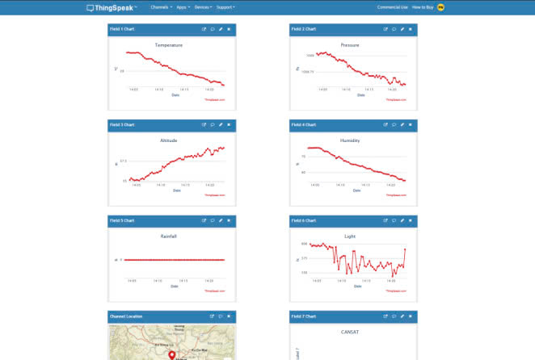

# CANSAT
A CANSAT project from K65-SAE-UET-VNU is small satellite to mesure weather, Humidity, Altitude and using LoRa RF to send the sensor data to Ground Station. We can real time tracking the data in webserver thingspeak at everywhere like an IoT Project^^.

# Thingspeak
Plot all sensors data in Thingspeak:
Humidity
Temperature
Altitude
Gyroscope
GPS
light
rain

My team from K65-SAE-UET

